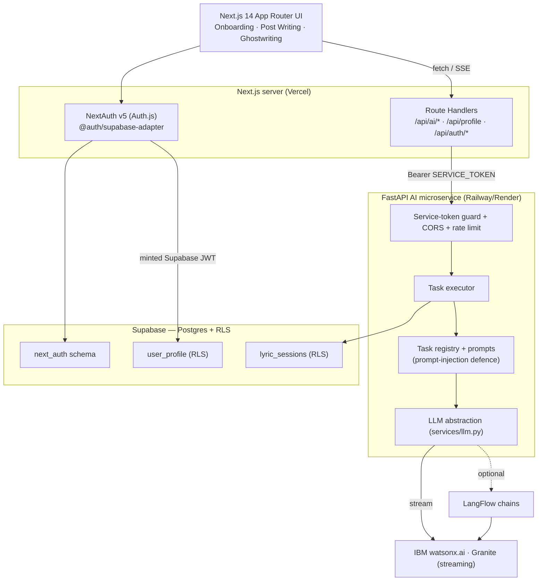

# Chimera — your AI-powered record label

Chimera gives independent creators the tools of a major label — a personal
manager, visual design, copywriting, and ghostwriting — as one AI-native studio
powered by **IBM watsonx / Granite**.

Built for the **IBM AI Builders Challenge — “Reimagine Creative Industries with AI.”**

---

## The problem

Independent musicians do everything themselves: writing captions, drafting
lyrics, briefing cover art, chasing gigs. Major-label artists have teams for all
of it. The tooling that exists is generic (a chatbot in a box) and forgets who
the artist is between tasks.

**Chimera is a creative studio that knows the artist.** A single `CreatorContext`
(stage name, genre, city, brand vibe, socials, recent outputs) is injected into
every AI task, so captions, lyrics, and art briefs all sound like *that* artist —
consistently, across modules.

**Who it's for:** independent musicians and self-managing creators who want
label-grade output without a label.

---

## What it does (modules)

| Module | What it does | Status |
|--------|--------------|--------|
| **Onboarding router** | Describe yourself → Granite classifies you (musician / influencer / video-creator) → routes you into the right portal | ✅ Live |
| **Post Writing** | Generates 3 platform-native Instagram/TikTok caption variants with hashtags, **streaming token-by-token** | ✅ Live |
| **Ghostwriting** | Chat-style lyric assistant — structured sections, rhyme labels & syllable counts, **multi-turn memory** that persists and resumes | ✅ Live |
| **Visual Design** | Expands a rough brief into a detailed Stable-Diffusion prompt (`build_image_brief`) + image generation | 🔒 Backend task built; UI on the roadmap |
| **Personal Manager** | Calendar, promoter outreach, concert-opportunity finder | 🗺️ Roadmap |

Only the **Musician** portal is open; Influencer and Video-Creator are visible
but locked.

---

## Architecture



### The trust boundary (security by design)
The browser never holds a third-party secret. It talks **only** to Next.js.
Next.js Route Handlers attach a shared `CHIMERA_SERVICE_TOKEN` and talk to
FastAPI. FastAPI talks to watsonx / HuggingFace / Supabase. Every FastAPI route
is guarded by a **timing-safe** service-token check; there are no public AI
routes.

### Identity & Row-Level Security
Auth is **NextAuth v5** with the Supabase adapter — users live in a dedicated
`next_auth` schema. On each session we **mint a Supabase-compatible JWT** (signed
with `SUPABASE_JWT_SECRET`, `role: authenticated`, `sub = user id`) and attach it
to the Supabase client, so Route Handlers read/write the database **as the
authenticated user under RLS** (`next_auth.uid() = user_id`). RLS is enabled on
**every table from the first migration** — the anon key is treated as public.

### The AI core
- **One LLM abstraction** (`services/llm.py`) wraps IBM watsonx `ChatWatsonx`.
  The blocking client build + inference run in worker threads (the event loop is
  never blocked); clients are cached per task-params; the model is swappable via
  `GRANITE_MODEL_ID`.
- **Task registry** — each task (`classify_creator`, `write_captions`,
  `write_lyrics`, `build_image_brief`) carries its own temperature/max-tokens and
  a strict Pydantic **output schema**, with one automatic repair retry on invalid
  JSON.
- **Prompt architecture** — a shared four-block skeleton (system role · creator
  context · task + schema · user input). User text is wrapped in `<user_input>`
  tags and the system prompt forbids those tags from overriding instructions —
  **prompt-injection defence** built in.
- **True token streaming** — watsonx streams tokens → FastAPI emits SSE
  (`token` → `result`) → the Next Route Handler pipes it through unbuffered →
  the client renders live text with a progress indicator.
- **LangFlow** — visual orchestration chains are authored for each task
  (`langflow/*.json`); the backend can route through LangFlow (`langflow_client`)
  or call watsonx directly via the LLM abstraction (the current default path).

---

## Tech stack

| Layer | Tech |
|-------|------|
| Frontend | Next.js 14 (App Router, TypeScript), Tailwind CSS, shadcn/ui, Fraunces + Geist, Lenis motion |
| Auth | NextAuth v5 (Auth.js) + `@auth/supabase-adapter`, GitHub OAuth |
| Backend | FastAPI, Pydantic v2, slowapi (rate limiting), structlog |
| AI | IBM watsonx.ai · Granite (via `langchain-ibm`), LangFlow |
| Data | Supabase (Postgres + Row-Level Security) |
| Images (roadmap) | HuggingFace (Stable Diffusion XL) |

---

## How we used IBM Bob

**IBM Bob was the primary development tool for the foundation of this project.**
Its contributions are recorded in git — every Bob-assisted commit carries an
`Assisted-by: IBM Bob` trailer:

```bash
git log --grep="Assisted-by: IBM Bob" --format="%h %s"
```

- **Phase 1 — full-stack foundation:** project conventions & security policy,
  the FastAPI microservice scaffold, the Next.js App Router scaffold, and the
  initial Supabase schema with **RLS from line one**.
  _(commits `14f2473`, `bf05f94`, `85f17b8`, `dafc494`, `38fee4c`)_
- **Phase 2 — the AI core:** the single LLM abstraction, the task registry &
  per-task params, the prompt architecture with injection defence, the four AI
  routes, and the LangFlow chains.
  _(commits `7f5ea5d`, `b83aaf7`, `7146533`)_

Phase 3 (the frontend UI, streaming integration, and design/motion system) and
the reliability fixes were built on top of that Bob-authored foundation.

---

## Why it matters for “Reimagine Creative Industries with AI”

Chimera reimagines the **record label** itself: instead of a chatbot bolted onto
a creative task, it's an AI studio organised around the artist's identity, where
IBM Granite does the creative heavy lifting (classification, copy, lyrics, art
direction) behind a secure, production-shaped architecture. It lowers the floor
for independent creators to produce label-grade work — the exact leverage the
challenge asks for.

---

## Setup

### Prerequisites
- Node 18+, Python 3.11+
- A Supabase project, an IBM watsonx.ai project, a GitHub OAuth app

### 1. Database (Supabase → SQL Editor, in order)
```
backend/db/migrations/001_initial_schema.sql
backend/db/migrations/002_next_auth_schema.sql
backend/db/migrations/003_repoint_user_profile_to_next_auth.sql
backend/db/migrations/004_lyric_sessions.sql
```
Then **expose the `next_auth` schema**: Supabase → Project Settings → API →
Exposed schemas → add `next_auth`.

### 2. Backend (FastAPI)
```bash
cd backend
python -m venv venv && source venv/bin/activate
pip install -r requirements.txt
cp ../.env.example .env   # fill in the backend values
uvicorn main:app --port 8000
```

### 3. Frontend (Next.js)
```bash
cd frontend
npm install
cp ../.env.example .env.local   # fill in the frontend values
npm run dev                     # dev on :3005 (port 3000 is often taken)
# production:
npm run build && npm run start -- -p 3005
```

### Environment variables
See [`.env.example`](.env.example) for the full annotated list. The essentials:

**Frontend (`frontend/.env.local`)**
| Var | Purpose |
|-----|---------|
| `AUTH_SECRET` | NextAuth session secret (`openssl rand -base64 32`) |
| `AUTH_URL` | Public app URL (`http://localhost:3005` or the deployed domain) |
| `AUTH_GITHUB_ID` / `AUTH_GITHUB_SECRET` | GitHub OAuth app |
| `NEXT_PUBLIC_SUPABASE_URL` / `NEXT_PUBLIC_SUPABASE_ANON_KEY` | Supabase public keys |
| `SUPABASE_SERVICE_ROLE_KEY` | Used server-side by the Supabase adapter |
| `SUPABASE_JWT_SECRET` | Signs the per-user Supabase JWT (RLS) |
| `FASTAPI_INTERNAL_URL` | FastAPI base URL (`http://localhost:8000`) |
| `CHIMERA_SERVICE_TOKEN` | Shared secret sent to FastAPI (must match backend) |

**Backend (`backend/.env`)**
| Var | Purpose |
|-----|---------|
| `CHIMERA_SERVICE_TOKEN` | Must match the frontend value |
| `ALLOWED_ORIGINS` | CORS allow-list (the frontend origin) |
| `WATSONX_API_KEY` / `WATSONX_PROJECT_ID` / `WATSONX_URL` | IBM watsonx.ai |
| `GRANITE_MODEL_ID` | e.g. `ibm/granite-8b-code-instruct` |
| `SUPABASE_URL` / `SUPABASE_SERVICE_ROLE_KEY` | DB access (service role) |

> The watsonx **project must be associated with a Watson Machine Learning
> instance**, and `WATSONX_URL` must match its region — otherwise the first
> inference call errors.

---

## Current status

**Live & verified end-to-end:** GitHub sign-in → onboarding classification →
Musician portal → Post Writing (streaming captions) → Ghostwriting (streaming,
multi-turn lyrics that persist and resume under RLS).

**Roadmap:** Visual Design UI (the `build_image_brief` task + HuggingFace image
generation), Personal Manager, Influencer & Video-Creator portals.

Chimera is a hackathon prototype: the demo path is solid, and the locked modules
are deliberately locked rather than half-built.

---

_Deployment notes: [`DEPLOYMENT.md`](DEPLOYMENT.md) · Engineering conventions:
[`CONVENTIONS.md`](CONVENTIONS.md)._
